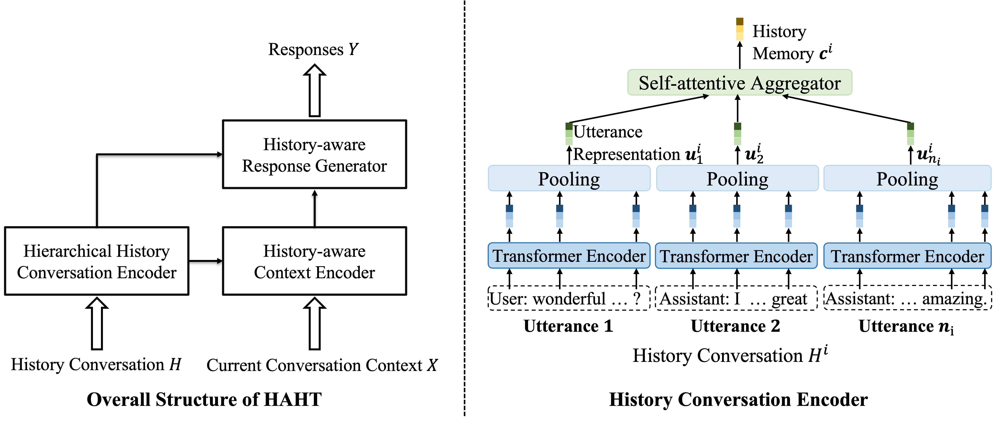
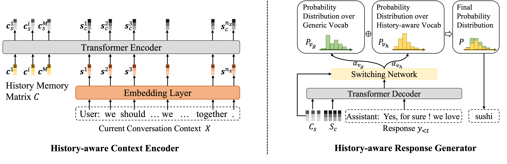

# HAHT


[History-Aware Hierarchical Transformer for Multi-session Open-domain Dialogue System](https://aclanthology.org/2022.findings-emnlp.247.pdf) <br>

Overview of HAHT




## Prerequisites
- Python 3.6
- PyTorch 1.10.0

## Getting Started

### Installation


```bash
python setup.py develop
```
### Download the pretrained blender90M model
#### This step is necessary to reproduce the results in the original paper. As the [ParlAI](https://github.com/facebookresearch/ParlAI) is archived, the pretrained model will not be downloaded automatically.

```bash
pip install gdown

cd data/
gdown --id 1qRcKgAQvAA-hPLjHDazxV8E3ngyYfKpo
tar -xzvf models.tar.gz
rm models.tar.gz
cd ..
```

You can also download [the file](https://drive.google.com/file/d/1qRcKgAQvAA-hPLjHDazxV8E3ngyYfKpo/view?usp=drive_link), extract it, and put the extracted folder under the data folder.

### Training

To train the model, run:

```bash
cd debug_scripts/blender_haht/
python finetune_haht.py
```

To evaluate the model, run:

```bash
python evaluate_haht.py --skip_generation False --model_parallel False --batchsize 32
```

### Logging

TensorBoard logs and models will be saved in `HAHT/data/tmp/all_session/` folder.
Generate the responses and coresponding input conversation context will be saved in `HAHT/debug_scripts/blender_haht/logs/`

### Discussion

If you have difficulties to get things working in the above steps, please let us know.


